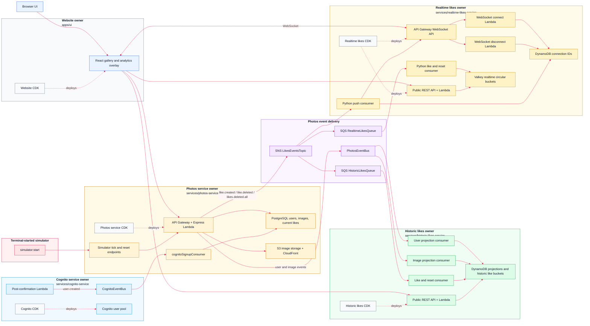

# AWS 08 - Realtime Likes Microservice

This reworked version builds directly on AWS 07's independently deployable microservice architecture. It adds a dedicated Python `realtime-likes-service` that listens to the photos service like events, keeps short lived realtime analytics in Valkey, exposes those buckets over a public API, and pushes browser refresh notifications over WebSockets.

The architectural baseline from AWS 07 stays in place: every service owns its runtime code, operational scripts, and CDK infrastructure. The former course `core-service` has been repatriated into `photos-service`, so photos, users, current likes, image storage, seed data, simulator endpoints, and the outbound photos event stream all live under `services/photos-service`.

## Architecture



## What This Version Teaches

This version combines the useful work from the original AWS 08 realtime likes sequence with the cleaner service ownership baseline from the reworked AWS 07 architecture:

- a Python Lambda microservice inside the existing pnpm/CDK monorepo
- service-local CDK for the realtime REST API, WebSocket API, SQS queue, Valkey cache, and connection storage
- SNS fan-out from the photos service `LikesEventsTopic` to multiple independent consumers
- a Valkey-backed realtime read model for recent image and author like activity
- a public realtime REST API for browser charts
- WebSocket browser push that tells visible analytics overlays when to refresh
- reset handling through the shared `likes.deleted.all` event
- UI analytics that combine accumulated historic likes with short-window realtime likes
- service-owned deploy, destroy, reset, seed, simulator, and test scripts

This version deliberately does not introduce the microfrontend split. The frontend is still the single `apps/ui` application.

## Deployable Owners

| Owner | Path | Owns |
| --- | --- | --- |
| Website app | `monorepo/apps/ui` | React UI, website hosting CDK, env generation, build and upload scripts |
| Cognito service | `monorepo/services/cognito-service` | Cognito user pool, hosted UI domain, post-confirmation Lambda, Cognito event bus, Cognito reset |
| Photos service | `monorepo/services/photos-service` | Express API, RDS, S3, image CloudFront distribution, photos event bus, SNS likes topic, Cognito signup ingest, seed, simulator, API tests |
| Historic likes service | `monorepo/services/historic-likes-service` | DynamoDB projections, historic like aggregates, SQS consumers, public historic likes API, historic reset and API tests |
| Realtime likes service | `monorepo/services/realtime-likes-service` | Python Lambdas, Valkey buckets, realtime SQS consumer, SNS push consumer, REST API, WebSocket API, connection storage, public API tests |
| Shared events | `monorepo/packages/events` | Cross-service event source, detail type, and payload contracts |

Every deployable owner has its own `cdk` folder. There is no central root CDK app.

```text
monorepo/apps/ui/cdk
monorepo/services/cognito-service/cdk
monorepo/services/photos-service/cdk
monorepo/services/historic-likes-service/cdk
monorepo/services/realtime-likes-service/cdk
```

## Event Model

The system uses EventBridge for service-owned projection streams and SNS for fan-out like events.

**Cognito signup events**

```text
Cognito post-confirmation Lambda
  -> CognitoEventBus
    -> CognitoSignupQueue
      -> photos-service cognitoSignupConsumer
        -> Postgres registered_user
```

Cognito owns authentication and publishes `user.created` with source `uptick.cognito`. The photos service owns the Postgres write model, so it consumes the event and inserts or updates `registered_user`.

**Photos projection events**

```text
photos-service
  -> PhotosEventBus
    -> historic-likes user projection queue
    -> historic-likes image projection queue
      -> DynamoDB read models
```

The photos service publishes projection events with source `uptick.photos`:

```text
user.created
user.updated
user.deleted
image.created
image.updated
image.deleted
```

The historic likes service builds DynamoDB user and image projections from that stream. Those projections let the analytics service understand authors and photos without reaching back into the photos service database.

**Like events**

```text
photos-service
  -> SNS LikesEventsTopic
    -> SQS HistoricLikesQueue
      -> historic-likes like and reset consumer
    -> SQS RealtimeLikesQueue
      -> realtime-likes Python like and reset consumer
    -> realtime-likes Python push consumer
        -> WebSocket API
          -> Browser UI
```

Like events use SNS because independent services can subscribe to the same stream without the photos service knowing their internal storage choices. The events that drive both likes services are:

```text
like.created
like.deleted
likes.deleted.all
```

`like.created` and `like.deleted` update current analytics. `likes.deleted.all` is published by the simulator reset path and tells the historic and realtime services to clear their own read models.

## Python Realtime Service

The realtime likes service is the first Python service in the course. The monorepo still uses pnpm, package scripts, and CDK, but the Lambda handlers under `services/realtime-likes-service/src` are Python modules.

The setup script lives at:

```text
services/realtime-likes-service/scripts/setup_python.py
```

It runs automatically before service type-checking or deployment. It:

1. finds a suitable Python installation
2. creates `.venv` if it does not already exist
3. installs dependencies from `requirements.txt` if that file exists
4. compile-checks the Python source code

The TypeScript-to-Python equivalents are:

| TypeScript | Python |
| --- | --- |
| `package.json` | `requirements.txt` |
| `pnpm install` | `pip install -r requirements.txt` |
| `node_modules` | `.venv` |
| `tsc --noEmit` | `python -m compileall src` |
| `export async function handler()` | `def handler()` |

You do not normally need to activate the virtual environment manually. The service scripts do that setup work for deployment and checks.

## Realtime Likes Flow

1. A user likes or unlikes a photo through the UI.
2. `photos-service` records the command in Postgres.
3. After the transaction commits, `photos-service` publishes a like event to the likes SNS topic.
4. `historic-likes-service` consumes the event and updates accumulated historic read models in DynamoDB.
5. `realtime-likes-service` consumes the same event and updates recent time buckets in Valkey.
6. The realtime push consumer observes the like stream and sends lightweight WebSocket messages to connected browsers.
7. Browsers refresh the realtime chart data through the realtime REST API.

The WebSocket messages are intentionally small. They are invalidation messages, not chart payloads.

```json
{
  "type": "realtime-bucket-changed"
}
```

```json
{
  "type": "likes-reset"
}
```

A bucket-change message tells the browser to refetch chart data. A reset message tells the browser to clear or refresh the visible chart state.

## Realtime Buckets

The realtime service stores short-window activity in Valkey. It tracks two views for the selected photo:

```text
image:{imageId}
author:{authorUserId}
```

Each key is a circular hash of recent buckets. The original lesson used 20 buckets; the finished browser-push version uses 5-second buckets so realtime and historic reset demos line up cleanly. Each bucket field stores the bucket start and count:

```text
bucketStart:count
```

Example:

```text
1718294400:12
```

When the same bucket slot comes around again, old data is replaced. The realtime service is only the recent activity lens; the historic service remains responsible for accumulated likes over longer periods.

## Data Ownership

**Photos service Postgres tables**

```text
registered_user
images
image_likes
```

Postgres is the source of truth for users known to the app, uploaded image metadata, and the current like state. `image_likes` stores the current relationship between a user and a photo:

```sql
CREATE TABLE IF NOT EXISTS image_likes (
    user_sub VARCHAR(255) NOT NULL,
    image_id INT NOT NULL,
    created_at TIMESTAMP DEFAULT CURRENT_TIMESTAMP,
    PRIMARY KEY (user_sub, image_id)
);
```

**Historic likes DynamoDB tables**

```text
UsersProjectionTable
ImagesProjectionTable
HistoricPhotoBucketLikes
HistoricAuthorBucketLikes
```

The projection tables hold the latest user and image read models. The aggregate tables hold sparse historic like buckets for images and authors.

**Realtime likes storage**

```text
Valkey realtime buckets
DynamoDB WebSocket connection table
```

Valkey holds recent image and author like buckets. DynamoDB stores active WebSocket connection IDs so the push consumer can notify connected browsers.

## Service APIs

### Photos service

The photos service is an Express app adapted to Lambda with `@codegenie/serverless-express`.

Public routes:

```text
GET    /public/health
GET    /public/gallery-photos
GET    /public/images/:imageId
POST   /public/simulation/tick
DELETE /public/simulation/likes
```

Authenticated routes:

```text
GET    /auth/photos/gallery
POST   /auth/photos/presigned-url
POST   /auth/photos/:imageId/like
GET    /auth/users/me
PUT    /auth/users/me/nickname
GET    /auth/admin/member
DELETE /auth/admin/photos
```

Anonymous users use `GET /public/gallery-photos`. Signed-in users use `GET /auth/photos/gallery`, which adds `likedByCurrentUser` to each photo where appropriate.

Toggling a like uses:

```text
POST /auth/photos/{imageId}/like
```

It returns the new current state:

```json
{
  "liked": true
}
```

### Historic likes service

The historic likes service has small direct Lambda handlers behind API Gateway.

Public routes:

```text
GET /public/health
GET /public/photo-likes?imageId=<image-id>
GET /public/author-likes?userId=<author-user-id>
GET /public/historic-likes
```

With an ID, each endpoint returns chart data for one photo or one author. Missing buckets are filled with zero so the UI can render stable charts.

### Realtime likes service

The realtime likes service exposes a public read API and a WebSocket endpoint:

```text
GET /public/health
GET /public/realtime-likes?imageId=<image-id>&authorUserId=<author-user-id>
WSS realtime likes browser push endpoint
```

Example realtime API response:

```json
{
  "image": [{ "label": "T-55", "likes": 0 }],
  "author": [{ "label": "T-55", "likes": 0 }]
}
```

The browser talks to three service endpoints:

- the photos service for gallery, auth, uploads, simulator commands, and current like state
- the historic likes service for accumulated chart data
- the realtime likes service for short-window chart data and WebSocket refresh messages

## UI Behaviour

The UI keeps the gallery workflow from AWS 07 and extends the analytics overlay:

- anonymous users can browse and search photos
- signed-in users can like and unlike photos
- a filled heart means the current user has liked the photo
- upload and profile links appear only when signed in
- each gallery tile has an analytics icon
- clicking the analytics icon opens a full-screen analytics overlay
- chart mode shows historic author likes, historic image likes, realtime author likes, and realtime image likes
- table mode shows the same underlying data in readable tables
- historic charts are accumulated line charts
- realtime charts are short-window bucket charts
- author and image charts in each pair share the same y-axis scale
- charts use simple integer y-axis labels and no visible time labels
- the overlay opens a WebSocket connection while visible
- realtime bucket-change push messages refresh chart data
- reset push messages clear the visible chart state

The UI reads the public historic and realtime service APIs directly from the browser. Those chart calls do not require a Cognito token.

## Seed Data And Simulator

Seed photos live at the repository root:

```text
photos-to-upload
```

The seed script is owned by the photos service:

```text
monorepo/services/photos-service/scripts/src/init-images.ts
```

It:

1. reads the image bucket name from SSM at `/photos/images/bucket-name`
2. reads local files from `../photos-to-upload` relative to the repository root through the service script default
3. creates seed users
4. uploads photos to S3
5. inserts or updates rows in Postgres
6. publishes matching `user.created` and `image.created` events to `PhotosEventBus`

The reworked seed model creates artwork authors and simulator viewers. Artwork is assigned to `author-*` users, and simulator activity uses `viewer-*` users.

Run seeding from the monorepo:

```bash
cd monorepo
pnpm run data:seed
```

Override the photo folder if needed:

```bash
PHOTOS_DIR=/absolute/path/to/photos pnpm -C services/photos-service run data:seed
```

Start the simulator from the monorepo:

```bash
pnpm run simulator:start
```

The simulator:

1. clears current Postgres likes by calling the simulator reset endpoint
2. publishes a `likes.deleted.all` event
3. calls `POST /public/simulation/tick` on a short interval
4. creates likes for random unliked viewer/photo pairs
5. stops when the tick limit is reached or no unliked pairs remain

Use `data:reset` when you want to clear the full deployed environment. Use `simulator:start` when you only want fresh like activity for charts.

## SSM Parameters

The deployed services communicate through service-owned SSM parameters:

```text
/photos/events/event-bus-name
/photos/events/likes-topic-arn
/photos/images/bucket-name
/photos/images/distribution-url
/photos/rds/secret-arn
/photos/cognito-signup/queue-url

/cognito/domain
/cognito/client-id
/cognito/user-pool-id
/cognito/events/event-bus-name

/historic-likes/users-table-name
/historic-likes/images-table-name
/historic-likes/photo-bucket-likes-table-name
/historic-likes/author-bucket-likes-table-name
/historic-likes/queue-url

/realtime-likes/queue-url
/services/photos-service/base-url
/services/historic-likes-service/base-url
/services/realtime-likes-service/base-url
/services/realtime-likes-service/websocket-url
```

The UI env generation script reads the public service URLs and Cognito settings from SSM and writes `monorepo/apps/ui/.env`.

## Local Workflow

Install dependencies from the monorepo folder:

```bash
cd monorepo
pnpm install
```

Bring up local database support services:

```bash
pnpm run bootstrap-up
```

Type-check the workspace:

```bash
pnpm run type-check
```

Seed photos and users:

```bash
pnpm run data:seed
```

Start the like simulator:

```bash
pnpm run simulator:start
```

Generate the UI environment from deployed SSM values:

```bash
pnpm -C apps/ui run generate-env
```

Run the UI locally against deployed services:

```bash
pnpm -C apps/ui run dev
```

The realtime service setup script creates its Python virtual environment and compiles the Python source before type-checking or deployment:

```bash
pnpm -C services/realtime-likes-service run setup
```

## Deployment

Deploy everything:

```bash
cd monorepo
pnpm run deploy-everything
pnpm run data:seed
```

`deploy-everything`:

1. deploys website hosting infrastructure from `apps/ui/cdk`
2. deploys Cognito and the post-confirmation trigger from `services/cognito-service/cdk`
3. deploys `photos-service-stack` from `services/photos-service/cdk`, then runs database migrations
4. deploys `historic-likes-service-stack` from `services/historic-likes-service/cdk`
5. deploys `realtime-likes-service-stack` from `services/realtime-likes-service/cdk`
6. generates UI env values, builds, and uploads the UI

Deploy Cognito before the photos service. The photos service imports `/cognito/user-pool-id` and `/cognito/events/event-bus-name`.

The photos service stack is the slow step on a cold account because it creates Aurora and CloudFront resources. Allow 30 to 45 minutes.

After deployment:

```bash
pnpm run type-check
pnpm -C services/photos-service run test:security
pnpm -C services/historic-likes-service run test:public-api
pnpm -C services/realtime-likes-service run test:public-api
pnpm run ui:url
```

Deploy one service or app:

```bash
pnpm run cognito-service:deploy
pnpm run photos-service:deploy
pnpm run historic-likes-service:deploy
pnpm run realtime-likes-service:deploy
pnpm run website:deploy
```

Destroy one service or app:

```bash
pnpm run website:destroy
pnpm run realtime-likes-service:destroy
pnpm run historic-likes-service:destroy
pnpm run photos-service:destroy
pnpm run cognito-service:destroy
```

Deploy only the UI after frontend changes:

```bash
pnpm -C apps/ui run generate-env
pnpm run website:deploy
```

Clean package artifacts:

```bash
pnpm run package-cleanup
```

Destroy everything:

```bash
pnpm run destroy-everything
```

## Data Reset

Reset deployed data back to a clean baseline:

```bash
pnpm run data:reset
pnpm run data:seed
```

`data:reset` delegates to service-owned reset scripts:

1. **photos service** migrates Postgres, clears `image_likes`, `images`, and `registered_user`, restores the `system` user, and empties the image bucket.
2. **historic likes service** purges the likes queue and clears DynamoDB projection and aggregate tables.
3. **cognito service** deletes Cognito users.

The reset path does not reseed automatically. Run `pnpm run data:seed` after reset.

If you need the script-managed Cognito test users recreated, run:

```bash
pnpm -C services/photos-service run test:security
```

## Useful Commands

```bash
pnpm run bootstrap-up
pnpm run bootstrap-down
pnpm run type-check
pnpm run photos-service:deploy
pnpm run historic-likes-service:deploy
pnpm run realtime-likes-service:deploy
pnpm run cognito-service:deploy
pnpm run website:deploy
pnpm run data:reset
pnpm run data:seed
pnpm run simulator:start
pnpm run ui:url
```

Service-local commands:

```bash
pnpm -C services/photos-service run database:migrate
pnpm -C services/photos-service run database:reset
pnpm -C services/photos-service run data:seed
pnpm -C services/photos-service run data:reset
pnpm -C services/historic-likes-service run data:reset
pnpm -C services/cognito-service run data:reset
pnpm -C services/realtime-likes-service run setup
pnpm -C services/realtime-likes-service run test:public-api
```

## Repository Shape

```text
monorepo/
  apps/
    ui/
      cdk/
      scripts/
      src/
  packages/
    events/
  scripts/
  services/
    cognito-service/
      cdk/
      src/
    photos-service/
      cdk/
      database/
      scripts/
      src/
    historic-likes-service/
      cdk/
      scripts/
      src/
    realtime-likes-service/
      cdk/
      scripts/
      src/
        consumers/
        handlers/
        utilities/
```

## Expected Behaviour

- Each deployable owner has its own CDK folder.
- The root package delegates deployment, destroy, reset, and test commands to owner packages.
- Cognito sign-up creates app users through the event path, not through a direct Postgres write in the Cognito trigger.
- The public gallery shows seeded artwork owned by `author-*` users.
- Anonymous users can browse and open analytics.
- Signed-in users can like and unlike photos.
- Current like state is stored in Postgres.
- The photos service publishes user and image projection events to `PhotosEventBus`.
- The photos service publishes like and reset events to SNS.
- The historic likes service consumes projection events and like events into DynamoDB.
- The realtime likes service consumes like events into Valkey.
- The realtime push consumer sends WebSocket invalidation messages.
- The public historic and realtime APIs return chart data without Cognito.
- The analytics overlay shows historic and realtime author and image likes.
- `simulator:start` generates live activity for the charts.
- Historic and realtime services both reset after `likes.deleted.all`.
- `pnpm run data:reset` followed by `pnpm run data:seed` returns the environment to the post-deploy baseline.
- `pnpm run type-check` passes.

## Troubleshooting

If deployment fails because an old stack still exists, delete the older CloudFormation stacks manually before redeploying. This reworked version expects owner-local stacks:

```text
website-stack
cognito-post-confirmation-stack
cognito-stack
photos-service-stack
historic-likes-service-stack
realtime-likes-service-stack
```

Older snapshots used names such as `api-stack`, `core-service-stack`, `events-stack`, `images-stack`, `rds-stack`, or central `cdk/*` stacks.

If the UI has stale service URLs, regenerate env values and redeploy the website:

```bash
pnpm -C apps/ui run generate-env
pnpm run website:deploy
```

If the gallery is empty after a reset, run:

```bash
pnpm run data:seed
```

If historic charts stay flat, run the simulator and wait for events to move through SNS, SQS, Lambda, and DynamoDB:

```bash
pnpm run simulator:start
```

If realtime charts stay flat, check that the realtime service deployed after the photos service, then run:

```bash
pnpm -C services/realtime-likes-service run test:public-api
pnpm run simulator:start
```

If browser push is not visible, remember that the UI does not show connection status. Open the analytics overlay, run the simulator, and watch for realtime chart refreshes as bucket-change messages arrive.

## Source Material Folded Into This Version

This reworked lesson synthesizes the content that originally appeared across:

- `aws07-historic-likes-microservice/00-starting-point`
- `aws07-historic-likes-microservice/01-ui-like-buttons`
- `aws07-historic-likes-microservice/02-api-eventbridge-projection-events`
- `aws07-historic-likes-microservice/03-historic-service-eventbridge-projections`
- `aws07-historic-likes-microservice/04-publish-like-sns-events`
- `aws07-historic-likes-microservice/05-consume-like-sqs-events`
- `aws07-historic-likes-microservice/06-like-simulator`
- `aws07-historic-likes-microservice/07-historic-likes-api`
- `aws07-historic-likes-microservice/08-ui-historic-analytics`
- `aws07-historic-likes-microservice/09-independent-microservices`
- `aws08-realtime-likes-microservice/01-realtime-service-skeleton`
- `aws08-realtime-likes-microservice/02-subscribe-to-likes-topic`
- `aws08-realtime-likes-microservice/03-consume-like-events`
- `aws08-realtime-likes-microservice/04-rest-api-ui-charts`
- `aws08-realtime-likes-microservice/05-browser-push-events`
- `aws09-backend-microservice-ownership/01-service-owned-infrastructure`

The current version keeps the learning content, but updates names and paths to the reworked architecture: `photos-service`, `PhotosEventBus`, `/photos/...` SSM parameters, owner-local CDK folders, and the realtime likes service included as a first-class deployable owner.
